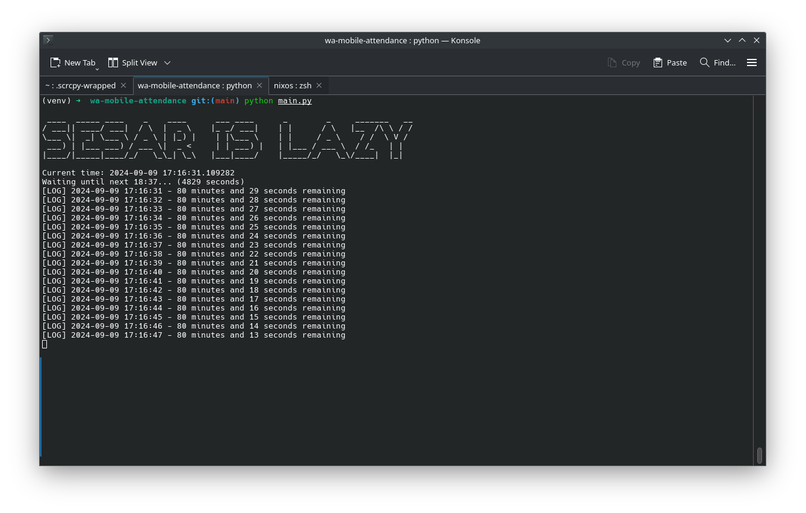
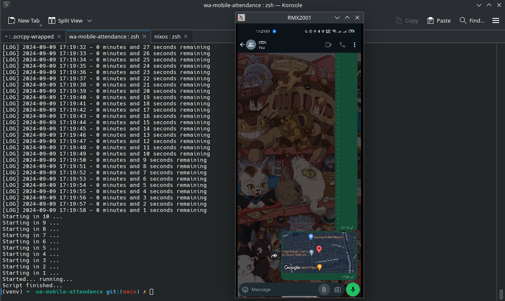

# Whatsapp Auto Attendance

The purpose of this project is to do automatic attendance via whatsapp sharing locationn to a specific chat. It works via scrcpy with adb to connect to the mobile device and then the automation is done from the PC who's running python to do the automation.

## Demo

## Setup

You need [scrcpy](https://github.com/Genymobile/scrcpy) and [text](https://github.com/nmeum/android-tools) connecting to your device where you run the python script.

1. Install necessary package from `requirements.txt` and `flake.nix` (if you use nix)
2. Setup connection with mobile device using scrcpy
   - do `adb devices` then `scrcpy -s <SERIALNUMBER>` to connect, mirror, and do interaction to the device
3. Setup desired time to share your location in [main.py](main.py)
4. Run the script
5. Open the desired chat room to share your location for the desired time
6. PUT THE CURSOR INTO THE CHAT BOX
7. Wait until finish
8. Done

## Acknowledgement

This project is one of the experimental experience of developing with nix with nixos. Using nix-direnv and custom shell was a lil bit confusing experience. Especially when trying to run the python but i got tkinter and python-dev-tools error. Installing it from pip doesn't seem to resolve the conflict since it fails to build, so the solution was just to include the necessary package into the flake.nix config. Overall, it is a very good experience
